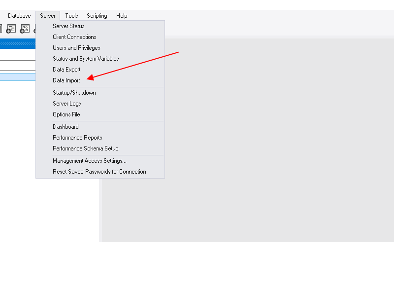
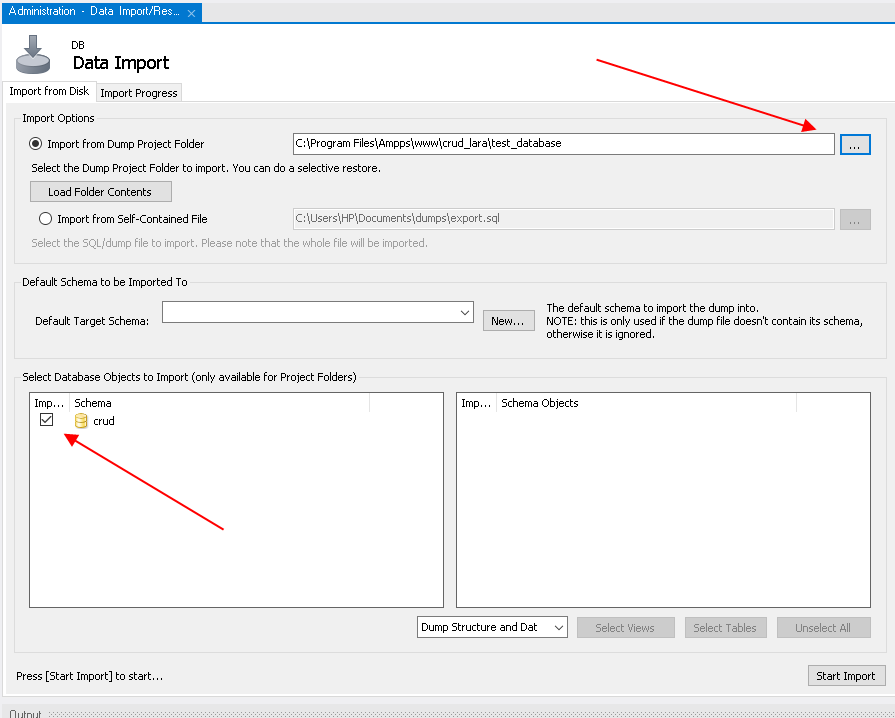

# CRUD project

### Project features:
##### - Create new record
##### - Read from database
##### - Update existing records
##### - Delete records


## How to use it:
Copy the repository URL and open it with the code editor, save the project to the root directory of your local server e.g.(AMPPS, XAMPP).

---------------------------------------------------------------------------------------------------------------------------------------------
#### Creat project DB:
Open MySQL Workbench. Make sure that MySQL Connection Login is set to:
```
    user = root
    password = mysql
```
Then go to Server -> Data Import. Select test_database from your root folder and start the import.



After you successfully loaded the test database go to browser -> localhost -> crud_laravel.

### Author: [Andrius Pilvelis](https://github.com/Apilv)
